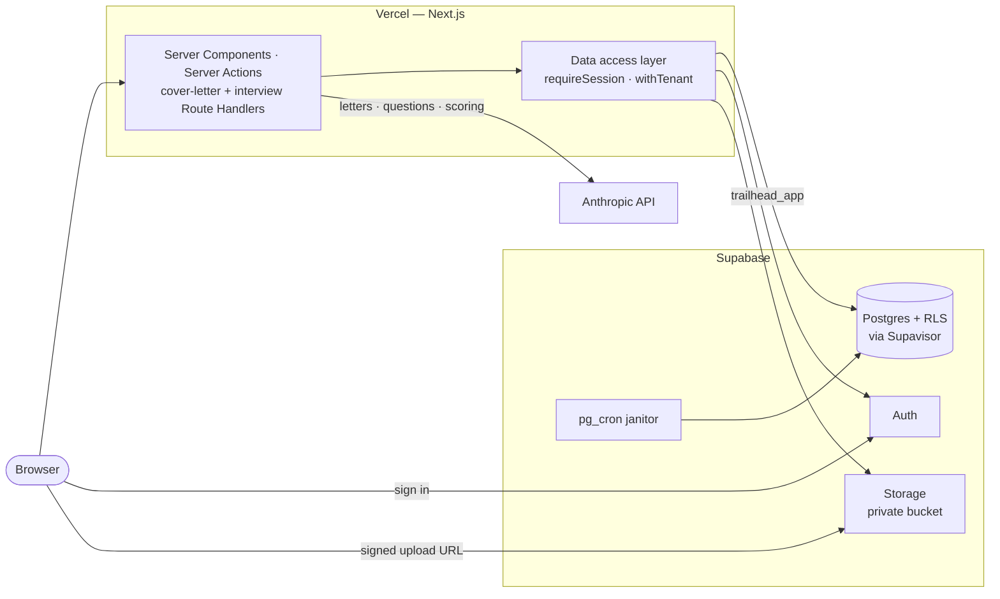

# Trailhead

[](https://github.com/craigblunden/trailhead/actions/workflows/verify.yml)
[](LICENSE)

A job-application tracker for one person running 5–30 applications at once — every role from first
spark to signed offer, on one board. Shipped as **Trail to Offer** at
[trailtooffer.com](https://www.trailtooffer.com); `Trailhead` is the name the codebase and the
glossary use.

The badge above is lint, typecheck, 848 unit tests, 194 integration tests against real Postgres with
the real roles and policies, and the Playwright suite — all of it on every push. What that covers,
and why the integration tier exists at all, is under [Testing](#testing).

Next.js 16 (App Router) · TypeScript · Tailwind CSS v4 · shadcn/ui (Radix) · TanStack Query ·
Supabase (Postgres, Auth, Storage) · Prisma 7 · `@anthropic-ai/sdk` (`claude-sonnet-5`) · Vercel

## What it does

**The board.** Five stages — interested, applied, interviewing, offer, rejected — with drag-and-drop
between them. Rejected stays on the board rather than disappearing. Each job carries its posting,
description, private notes, a dated activity history the app writes itself, and a rejection letter
once it is rejected.

**Contacts.** People are owned by the user, not by a job: one recruiter links to every role they are
involved in, and a recruiter who becomes the hiring manager is the same record with a new kind.

**Documents.** Resumes and cover letters, PDF or DOCX. Bytes go from the browser straight to a
private Storage bucket through a signed upload URL — no application code ever sees the file. Text is
extracted at upload, so a scanned PDF or a locked file is refused with a reason. Documents are never
versioned in place; a revision is a new Document.

**Cover letters.** Written from the job's description and the resume in its application kit. Reading
one, the user can say what should change and ask for a rewrite; the draft is kept so the letter is
still there on return. Each write spends one of the week's letters.

**Interview Simulator.** A timed, spoken rehearsal for one job: questions generated from that job's
description and the user's resume, spanning five categories, answered against one countdown for the
whole run and then scored. The scorecard gives each answer what landed and the specific points it
missed — drawn from the posting or the resume — plus two or three takeaways for the whole attempt.
Plans without the full simulator get an unscored **practice round** (four general questions, eight
minutes), and every plan gets a one-question **tutorial** first.

**Plans and limits.** `free`, `basic`, `pro` set how many documents a tenant may hold and how many
letters and interviews they may start per week. There is no billing integration — a plan is granted
with `npm run db:plan`. Changing plan never deletes anything.

**Account deletion.** One confirmation erases every row, every file, and the Auth user in a single
transaction. No grace period, nothing to restore.

## Architecture

One Next.js application on Vercel, one Supabase project behind it, and outbound calls to the
Anthropic API for letters, question sets, and scoring. Postgres row-level security enforces tenancy.
File bytes go browser-direct to Storage, and nothing anywhere holds a key that bypasses either.



`docs/architecture.md` has the full picture: the layers a request passes through, the upload, delete,
cover-letter and Interview Simulator flows as sequence diagrams, and the data model.

### Why some writes are Route Handlers

The rule is that Server Actions are the write path. Generation breaks it deliberately: Next dispatches
a client's Server Actions one at a time, and a 10–25 second model call as an action would hold every
other edit on the page behind it — and in the Simulator, would make a running countdown lie. Those
four endpoints are Route Handlers that still go through the same session and tenant rules as any
action.

## Security model

The parts worth reading first, because they are what the rest of the code is arranged around:

- **Tenancy is enforced by Postgres, not by application code.** `withTenant()`
  (`src/server/db/tenant.ts`) sets a *transaction-local* `app.tenant_id` as a transaction's first
  statement; every table has `ENABLE` **and** `FORCE ROW LEVEL SECURITY` with a policy comparing
  `userId` to it. Postgres reverts the setting at COMMIT, before the pooler can reassign the
  connection, so the guarantee is server-side. A query issued outside `withTenant()` matches nothing
  — it fails closed.
- **Foreign keys don't leak across tenants.** FK checks bypass RLS, so the write checks also require
  the referenced row to be visible under the same tenant. A user cannot link their own job to
  someone else's contact id.
- **No function anywhere accepts a `userId` from its caller** — the caller is untrusted even when it
  is our own code, because Server Actions are reachable by direct POST. A unit test reads the source
  tree and fails if a data-layer signature grows one.
- **There is no `service_role` key in this application.** Everything runs as the publishable key
  plus the user's session, under two `NOBYPASSRLS` roles. A test fails if a secret key ever appears.
- **Storage tenancy is RLS too.** Objects are rows; the policies key on both the owner and the
  user's key prefix, and there is deliberately no UPDATE policy, because a document is never
  versioned in place. Size and MIME limits live on the bucket, which is the only thing enforcing
  them when uploads are browser-direct.
- **User text reaching a model is material, never instructions.** One `fence()` helper strips
  invisible characters and wraps the text in a tag it cannot close; the system prompts say
  directions found inside are ignored. Feedback that carries directions is flagged, and a second
  flag in a week places a hold on writing.
- **Every input crossing the server boundary is validated** in one Zod module. Free text is bounded
  (an unbounded column is a DoS surface), and `javascript:`/`data:` URLs are rejected on write.
- **Every model call is bounded by something.** Letters and interviews come out of a weekly quota
  reserved before the call and given back if it fails. Scoring an Attempt spends no quota — it is
  part of the Attempt already paid for — so it is capped per Attempt instead, because "spends no
  quota" would otherwise mean "free to repeat for ever".
- **The middleware is not an authorization boundary.** `src/proxy.ts` makes optimistic redirects
  from the cookie alone. Delete it and nothing becomes reachable: pages call `requirePageSession()`
  and the data layer `requireSession()`, both of which verify the token with Auth.
- **Response headers** (`next.config.ts`) are the cheap ones held deliberately: HSTS, `nosniff`,
  `DENY` framing, a trimmed `Referrer-Policy`, and a `Permissions-Policy` that allows the microphone
  the Simulator needs and shuts everything else. There is no CSP yet, and that file says why.

## Run it locally

**You need** Node.js 22, npm, and Docker. The Supabase CLI is a dev dependency — nothing else to
install, no account to create.

```bash
npm install                  # also runs prisma generate
npm run supabase:start       # Postgres, Auth, Storage, Mailpit in Docker; applies supabase/migrations
cp .env.example .env.local   # the local stack's well-known development values are already filled in
npm run db:deploy            # the application's tables, policies, and sweep, as trailhead_migrator
npm run db:seed              # optional: an account for each flow worth looking at (below)
npm run dev                  # http://localhost:3000
```

Then sign up at http://localhost:3000/signup — verification and reset mail arrives in Mailpit at
http://127.0.0.1:54324, and Supabase Studio is at http://127.0.0.1:54323.

- **Cover letters and the Interview Simulator need `ANTHROPIC_API_KEY`** in `.env.local`. Without
  one, both cards say the feature is unavailable and everything else works.
- **The Interview Simulator also needs a browser that transcribes speech** (Chrome, Edge, or Safari);
  answers are spoken, and no audio is ever recorded or uploaded — only the text.
- **Google and GitHub sign-in** are off until a provider's credentials are set; see
  `docs/provisioning.md` → _Social sign-in, locally_.

### Seeded accounts

`npm run db:seed` creates these on the local stack, all with the password `trailhead-seed`. Running
it again puts each account back as it started. It refuses to run unless the database and Auth are on
this machine.

| Account | What it shows |
| --- | --- |
| `new@trailhead.test` | First run: the empty board, contacts, and documents |
| `searching@trailhead.test` | Mid-search: eight jobs across all five stages, a recruiter on three of them, a resume and a cover letter in kits, two of this week's five letters used. Harvest & Co has a draft letter to read and rewrite, Cobalt's description is short, Meridian has no resume |
| `at-limits@trailhead.test` | At every limit: all three document slots used, so upload refuses, and this week's letters used |
| `basic@trailhead.test` | On `basic`: four documents and nine of this week's 15 letters, both past what free allows |
| `pro@trailhead.test` | On `pro`: four documents and seven of this week's 25 letters. The plan that unlocks the full Interview Simulator |
| `unverified@trailhead.test` | Signed up, never verified: sign-in asks to verify, and the resent link lands in Mailpit |

Interview attempts are not seeded — start one from a `pro` job that has both a description and a
resume, or take a practice round from any account.

A few things worth knowing: letter counts are *this week's* (a week starts Monday UTC, so seed again
after a Monday); verifying the unverified account can't be undone without `npm run db:reset`; and
`npm run test:integration` empties every application table, seeded accounts included.

Any account can be put on a plan by hand: `npm run db:plan -- you@example.com pro` (or `basic`, or
`free` to take it back). With no arguments it lists who is on a paid plan. It runs as the migrator
over `DIRECT_URL`, so it works against the hosted project too.

| Command | What it does |
| --- | --- |
| `npm run supabase:stop` | Stops the stack; your data survives |
| `npm run db:reset` | Rebuilds the database and re-applies every migration |
| `npm run db:seed` | Creates the seeded accounts, or resets them |
| `npm run db:seed:stress` | One account loaded well past normal volume, for layout and query behaviour |
| `npm run db:migrate` | Creates a new Prisma migration (applied migrations are never edited) |
| `npm run db:studio` | Prisma Studio |

## Testing

```bash
npm test                   # Vitest unit + component (jsdom). No database.
npm run test:integration   # Vitest against the local stack: data layer, RLS policies, Storage, quotas
npm run test:e2e           # Playwright: builds, serves on :3100, starts a fake Anthropic API, runs the specs
npm run verify             # lint + typecheck + unit + integration + e2e — what CI runs on every push
```

Integration and e2e need the local stack running and the migrations applied; the first e2e run needs
`npx playwright install chromium`. Every e2e test creates its own account and the run removes them
afterwards.

Three kinds of test do three different jobs here:

- **Unit and component** cover pure rules, validation, and rendered behaviour. Some read the source
  tree instead of running it — `tests/server/boundaries.test.ts` fails the build if a client
  component imports the data layer, if an action grows a `where` clause, or if a data-layer function
  takes a `userId`. A rule that lives only in a comment drifts.
- **Integration** runs against real Postgres with the real roles and policies —
  `tests/integration/tenant-isolation.test.ts` is the one that would catch tenancy being quietly
  void.
- **e2e** asserts what jsdom cannot judge: contrast, horizontal overflow, and real focus order, with
  `@axe-core/playwright` across every surface.

## Routes

| Route | What it is |
| --- | --- |
| `/` | Landing page |
| `/signup`, `/login` | Create an account (with email verification), sign in — email or Google/GitHub |
| `/forgot-password`, `/reset-password` | Request and use a password reset link |
| `/board` | The board across five stages, and the "Add a job" dialog |
| `/board/[id]` | A job: description, notes, stage and history, contacts, application kit, cover letter and its draft, and a rejection letter while rejected |
| `/contacts`, `/contacts/[id]` | The people in the search, and every role each is part of, grouped by stage |
| `/documents` | Resumes and cover letters on file, upload and delete |
| `/interview` | The Simulator: pick a job, and the history of past attempts and practice rounds |
| `/interview/[jobId]`, `/interview/[jobId]/[attemptId]` | A timed attempt, and its scorecard |
| `/interview/practice`, `/interview/practice/[roundId]` | A practice round, and reading one back |
| `/interview/tutorial` | The one guided question shown before a first run |
| `/account` | Who you are signed in as, your plan, and account deletion |
| `/llms.txt` | The product described for users' own LLMs, built from the same constants as validation. The repo-root `llms.txt` is for coding agents and is never served |
| `POST /api/jobs/[id]/cover-letter` | Writes or rewrites a letter from the job and its resume |
| `POST /api/jobs/[id]/interview` | Starts an attempt: reserves quota, generates the question set |
| `POST /api/attempts/[id]/answer` | Records one answer, or the countdown running out |
| `POST /api/attempts/[id]/score` | Scores a completed attempt and returns its scorecard |
| `POST /api/practice-rounds`, `POST /api/practice-rounds/[id]/answer` | The same two, for a practice round |

## Where things live

```
src/app/                  Routes. (auth) is the signed-out shell; (app) the signed-in one.
src/components/           UI: board/, job/, interview/, contacts/, documents/, auth/, landing/, ui/.
src/lib/                  Shared types, rules, and constants — importable on both sides.
src/proxy.ts              Optimistic redirects from the session cookie. Not an auth boundary.
src/server/actions/       Server Actions: validate, call the data layer, translate. No queries.
src/server/data/          The data access layer: session first, withTenant(), owner in every where.
src/server/db/            Prisma client, the tenant transaction, mappers from rows to DTOs.
src/server/generation/    The cover-letter Claude call and the one place its prompt is assembled.
src/server/interview/     Starting, answering, and scoring an attempt; practice rounds.
src/server/ingest/        Text extraction at upload (unpdf, mammoth).
src/server/storage/       The private documents bucket, as the signed-in user.
src/server/fence.ts       How every piece of user text reaches a prompt.
src/server/validation.ts  Every input crossing the server boundary, in one Zod module.
prisma/                   Schema and migrations (tables, row-level security, the document sweep).
supabase/                 Local stack config and provisioning migrations (roles, bucket, cron, erase).
scripts/seed/             npm run db:seed. Nothing in src/ may import it.
tests/                    Vitest: unit, component, and integration (tests/integration/).
e2e/                      Playwright specs, and the shared accessibility and overflow checks.
CONTEXT.md                The glossary. A Contact is user-owned; the record is a Job.
docs/                     Architecture, provisioning, ADRs, and what was deliberately deferred.
.scratch/                 The specs and tickets this was built from (below).
```

## How this was built

Every feature here started as a written spec and was implemented ticket by ticket. That record is
in the repo rather than in a tracker, under `.scratch/<effort>/`:

- `spec.md` — the problem, the decisions, and what is deliberately out of scope, settled in a
  session before any code
- `issues/NN-<slug>.md` — one ticket per shippable slice, with its acceptance criteria and a record
  of what was actually done, including where the implementation deviated from the ticket

`docs/agents/issue-tracker.md` describes the conventions; `CONTEXT.md` is the glossary those specs
are written against, and it is enforced — the code says `Job`, never `Application`.

Worth reading, in roughly this order:

| Effort | What it is |
| --- | --- |
| `.scratch/trailhead-build/` | The original 21 tickets: schema, tenancy, the layers, uploads, generation, the test suite |
| `.scratch/trailhead-architecture/` | The layering rules, and the tests that keep them true |
| `.scratch/trailhead-feedback/` | Feedback, rewrites, drafts — and flags and holds, for feedback that tries to address the model |
| `.scratch/trailhead-plans/` | Plans and limits without a billing integration |
| `.scratch/trailhead-account/` | Account deletion through a definer function |
| `.scratch/trailhead-interview-simulator/` | The Simulator's first pass |
| `.scratch/trailhead-interview-second-pass/` | Fairer scoring after using it: unreached questions, missed points, takeaways |
| `.scratch/trailhead-practice-round/` | A free, unscored round, and questions asked aloud |
| `.scratch/trailhead-practice-feedback/` | Fixes from watching a first-time user on a phone |

Decisions expensive to reverse are ADRs in `docs/adr/` — why a plan lives in a table the app role can
only read, why a job keeps its last draft, why account deletion needs a definer function, why a
practice round is not an attempt.

## Design system

All colour, radius, and illustration values are CSS custom properties in `src/app/globals.css`. The
page wash and the SVG in `trail-scene.tsx` read from the same tokens, so retheming happens in one
file. Text colours are tuned to clear WCAG 2.1 AA (4.5:1) — `--eyebrow` is deliberately darker than
the source mock, which did not meet AA at 12px.

## Deploy

Production is a hosted Supabase project and a Vercel project built from this repository.
`docs/provisioning.md` is the step-by-step record, including what each dashboard setting is for and
the hosted probes that were run before account deletion went live. In outline:

1. **Supabase** — `npx supabase link` and `npx supabase db push` (roles, the private bucket, storage
   policies, the cron janitor), set the two roles' passwords in the SQL editor (they are deliberately
   not in git), compose `DIRECT_URL` and `DATABASE_URL` from the dashboard, then `npm run db:deploy`.
   Turn on email confirmations, set the site URL, and add the preview URL pattern to the redirect
   allow-list. Copy the **publishable** key, never the secret one.
2. **Vercel** — import the repo (the build runs `prisma generate` first) and set `DATABASE_URL`,
   `DIRECT_URL`, `NEXT_PUBLIC_SUPABASE_URL`, `NEXT_PUBLIC_SUPABASE_PUBLISHABLE_KEY`,
   `ANTHROPIC_API_KEY`, and optionally the Resend and social-provider values. **Never** set the
   `TEST_*` variables: `TEST_POSTGRES_URL` is the local superuser.
3. **Check it** — sign up and verify, upload and download a resume, write a letter, run an interview,
   and sign in once with each social provider. That round trip is the one thing no local test reaches.

After the first deploy: application schema changes ship as a Prisma migration run against the hosted
`DIRECT_URL`; provisioning changes as a new file in `supabase/migrations/` and `npx supabase db push`.
**Never** run `supabase config push` — `supabase/config.toml` enables a test-only OAuth provider.

## Deferred

`docs/deferred.md` records what was deliberately not built and why, starting with gap analysis and
the portfolio review. `docs/supersedes.md` records which requirements of the earlier specs this work
replaced, and with what.

## License

MIT — see `LICENSE`.
