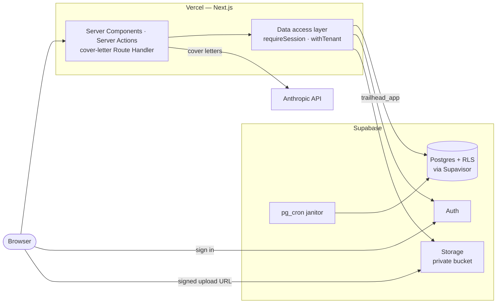

# Trailhead

A tracker for one job seeker pursuing 5–30 roles at once — every role from
first spark to signed offer, on one board. Accounts, a private database per user, the people in the
search, the documents that go out with each job, and cover letters written from them and rewritten
from your feedback.

## Stack

Next.js 16 (App Router) · TypeScript · Tailwind CSS v4 · shadcn/ui (Radix) · TanStack Query ·
Supabase (Postgres, Auth, Storage) · Prisma 7 · `@anthropic-ai/sdk` (`claude-sonnet-5`) · Vercel

## Architecture

One Next.js application on Vercel, one Supabase project behind it, and one outbound call to the
Anthropic API. Postgres row-level security enforces tenancy. File bytes go from the browser straight
to Storage, and nothing holds a key that bypasses either.



`docs/architecture.md` has the full picture:
- the layers a request passes through
- the upload, delete, and cover-letter flows, as sequence diagrams
- the data model

## Run it locally

**You need** Node.js 22, npm, and Docker (Docker Desktop on macOS and Windows). The Supabase CLI is
a dev dependency, so there is nothing else to install and no account to create.

From a clean clone:

```bash
npm install                  # also runs prisma generate
npm run supabase:start       # Postgres, Auth, Storage, Mailpit in Docker; applies supabase/migrations
cp .env.example .env.local   # the local stack's well-known development values are already filled in
npm run db:deploy            # the application's tables, policies, and sweep, as trailhead_migrator
npm run db:seed              # optional: an account for each flow worth looking at (below)
npm run dev                  # http://localhost:3000
```

Then:

- **Sign up** at http://localhost:3000/signup. Verification and password-reset mail arrives in
  Mailpit at http://127.0.0.1:54324. Supabase Studio is at http://127.0.0.1:54323.
- **Cover letters** need `ANTHROPIC_API_KEY` in `.env.local`. Without one, the card says generation
  is unavailable and everything else works.
- **Google and GitHub sign-in** are off until a provider's credentials are set; see
  `docs/provisioning.md` → _Social sign-in, locally_.

**Seeded accounts.** `npm run db:seed` creates these on the local stack, all with the password
`trailhead-seed`, and prints what each one is for. Running it again puts each account back as it
started, so anything done while signed in as one is lost. It refuses to run unless the database and
Auth are on this machine.

| Account | What it shows |
| --- | --- |
| `new@trailhead.test` | First run: the empty board, contacts, and documents |
| `searching@trailhead.test` | Mid-search: eight jobs across all five stages, a recruiter on three of them, a resume and a cover letter in kits, and two of this week's five letters used. Harvest & Co has a draft letter to read and rewrite, Cobalt's description is short, and Meridian has no resume |
| `at-limits@trailhead.test` | At every limit: all three document slots used, so upload refuses, and this week's letters used, so Tidewater's card says when the next ones arrive |
| `basic@trailhead.test` | On the basic plan: four documents on file and nine of this week's 15 letters used, both past what free allows. Wattle Energy is ready to write another |
| `pro@trailhead.test` | On the pro plan: four documents on file and seven of this week's 25 letters used, both past what free allows. Summit Devtools is ready to write another |
| `unverified@trailhead.test` | Signed up and never verified: sign-in asks to verify, and the resent link lands in Mailpit |

- **Cover-letter states need `ANTHROPIC_API_KEY`.** Without it, every job's cover-letter card says
  letters aren't available: the letter count, the reset day, and the ready, short, and no-resume
  states only show with it set.
- **Letter counts are this week's.** A week starts on Monday (UTC). Seed again after a Monday to
  bring the counts back.
- **Verifying the unverified account can't be undone.** Once you've followed its link, seeding leaves
  it verified and says so; `npm run db:reset` starts it over.
- **`npm run test:integration` empties every application table**, including the seeded accounts'
  data. Seed again afterwards.
- **Any account can be put on a Plan by hand**: `npm run db:plan -- you@example.com basic` (or
  `pro`), and `free` to take it back. With no arguments it lists who is on basic or pro. It runs as the migrator over
  `DIRECT_URL`, so it works against the hosted project too (`docs/provisioning.md`).

The accounts are written in `scripts/seed/accounts.ts`. The seed builds them with the app's own
rules and validation, and `tests/seed/` fails if an account stops showing its flow.

Day to day:

| Command | What it does |
| --- | --- |
| `npm run supabase:stop` | Stops the stack; your data survives. |
| `npm run db:reset` | Rebuilds the database from scratch and re-applies every migration. |
| `npm run db:seed` | Creates the seeded accounts, or resets them to how they started. Run it again after `db:reset`. |
| `npm run db:migrate` | Creates a new Prisma migration from a schema change (applied migrations are never edited). |
| `npm run db:studio` | Prisma Studio. |

## Testing

```bash
npm test                   # Vitest unit + component (jsdom). No database.
npm run test:integration   # Vitest against the local stack: data layer, policies, Storage, the quota
npm run test:e2e           # Playwright: builds, serves on :3100, starts a fake Anthropic API, runs the specs
npm run verify             # lint + typecheck + unit + integration + e2e — what CI runs on every push
```

Integration and e2e tests need the local stack running (`npm run supabase:start`) and the
migrations applied. Every e2e test creates its own account, and the run removes the accounts it
created from the local stack when it ends. The first e2e run needs a browser:
`npx playwright install chromium`.

jsdom cannot judge layout or computed colour, so these are asserted in `e2e/`:
- contrast
- horizontal overflow
- real focus order

CI (`.github/workflows/verify.yml`) runs the same `npm run verify` on Ubuntu against the Supabase
CLI stack.

## Deploy

Production is a hosted Supabase project and a Vercel project built from this repository.
`docs/provisioning.md` is the step-by-step record, including what each dashboard setting is for.
This section is the order to do it in.

**1. Supabase.** Do this once, from a dashboard login:

```bash
npx supabase link --project-ref <ref>
npx supabase db push          # roles, the private documents bucket, storage policies, the cron janitor
```

- In the SQL editor, give the two roles their passwords (they are deliberately not in git):
  `alter role trailhead_migrator password '…';` and `alter role trailhead_app password '…';`.
- Compose the database URLs from _Project Settings → Database_:
  - `DIRECT_URL`: the direct connection, user `trailhead_migrator`, port 5432.
  - `DATABASE_URL`: the transaction pooler, user `trailhead_app.<ref>`, port 6543.
- Apply the application migrations with those two URLs in your environment: `npm run db:deploy`.
- Under _Authentication_:
  - Turn email confirmations on and set the minimum password length to 8.
  - Set the site URL to the production URL.
  - Add the Vercel preview URL pattern to the redirect allow-list.
- From _Project Settings → API_, copy the project URL and the **publishable** key. Never copy the
  secret or `service_role` key: nothing here uses one, and a test fails if one appears.

**2. Vercel**

- Import the repository (preset: Next.js; the default build runs `prisma generate` first).
- Set these for _Production_ and _Preview_:

  | Variable | Value |
  | --- | --- |
  | `DATABASE_URL`, `DIRECT_URL` | from step 1 |
  | `NEXT_PUBLIC_SUPABASE_URL`, `NEXT_PUBLIC_SUPABASE_PUBLISHABLE_KEY` | from step 1 |
  | `ANTHROPIC_API_KEY` | a key created for this project alone |
  | `SUPABASE_AUTH_EXTERNAL_{GOOGLE,GITHUB}_{CLIENT_ID,SECRET}` | optional; a provider's button shows only when both of its values are set |

  **Never** set the `TEST_*` variables on a hosted project: `TEST_POSTGRES_URL` is the local
  superuser.
- Deploy, then add the deployment URL to Supabase's redirect allow-list.

**3. Check it**

- Sign up with a real address, then verify it.
- Upload a resume and download it.
- Write a cover letter.
- If social sign-in is on, sign in once with each provider. That round trip is the one thing no local
  test can reach.

**Schema changes after the first deploy**
- **Application schema:** commit a new migration, then run `npm run db:deploy` against the hosted
  `DIRECT_URL` before the code that needs it ships.
- **Provisioning (roles, bucket, cron):** add a new file to `supabase/migrations/`, then run
  `npx supabase db push`.
- **Never** run `supabase config push`: `supabase/config.toml` enables a test-only OAuth provider.

## Routes

| Route | What it is |
| --- | --- |
| `/` | Landing page |
| `/signup`, `/login` | Create an account (with email verification), sign in — email or Google/GitHub |
| `/forgot-password`, `/reset-password` | Request and use a password reset link |
| `/board` | The board across five stages, and the "Add a job" dialog |
| `/board/[id]` | A job: description, notes, stage and history, contacts, application kit, cover letter and its draft, and a Rejection letter while rejected |
| `/contacts`, `/contacts/[id]` | The people in the search, and every role each one is part of, grouped by stage |
| `/documents` | Resumes and cover letters on file (up to three), upload and delete |
| `/llms.txt` | The product described for users’ own LLMs: each page and what its forms accept. Built from the same constants as validation; the repo-root `llms.txt` is for coding agents and is not served |
| `POST /api/jobs/[id]/cover-letter` | Writes a cover letter from the job and the resume in its application kit |

## Where things live

```
src/app/                  Routes. (auth) is the signed-out shell; (app) the signed-in one.
src/components/           UI: board/, job/, contacts/, documents/, auth/, landing/, ui/ (shadcn).
src/lib/                  Shared types, rules, and constants — importable on both sides.
src/server/actions/       Server Actions: validate, call the data layer, translate. No queries.
src/server/data/          The data access layer: session first, withTenant(), owner in every where.
src/server/db/            Prisma client, the tenant transaction, mappers from rows to DTOs.
src/server/ingest/        Text extraction at upload (unpdf, mammoth).
src/server/generation/    The Claude call and the one place its prompt is assembled.
prisma/                   Schema and migrations (tables, row-level security, the document sweep).
supabase/                 Local stack config and the provisioning migration (roles, bucket, cron).
scripts/seed/             npm run db:seed: the local seeded accounts. Nothing in src/ may import it.
tests/                    Vitest: unit, component, and integration (tests/integration/).
e2e/                      Playwright specs, and the shared accessibility and overflow checks.
CONTEXT.md                The glossary. A Contact is user-owned; the record is a Job.
docs/                     Architecture, provisioning, what this work superseded, and what was deferred.
```

## Design system

All colour, radius, and illustration values are CSS custom properties in `src/app/globals.css`. The
page wash `scene-wash` and the SVG in `trail-scene.tsx` read from the same tokens, so retheming
happens in one file.

Text colours are tuned to clear WCAG 2.1 AA (4.5:1). Note that `--eyebrow` is deliberately darker than
the source mock, which did not meet AA at 12px.

## Decisions and deferrals

- `docs/architecture.md`: how the system fits together, in diagrams.
- `docs/supersedes.md`: which requirements of the Phase-1 and Phase-2 specs this work replaced, and
  with what.
- `docs/deferred.md`: what was deliberately not built, starting with gap analysis and the portfolio
  review, with their open questions.
- `.scratch/trailhead-build/`: the tickets this was built from, each with a record of what was done.
