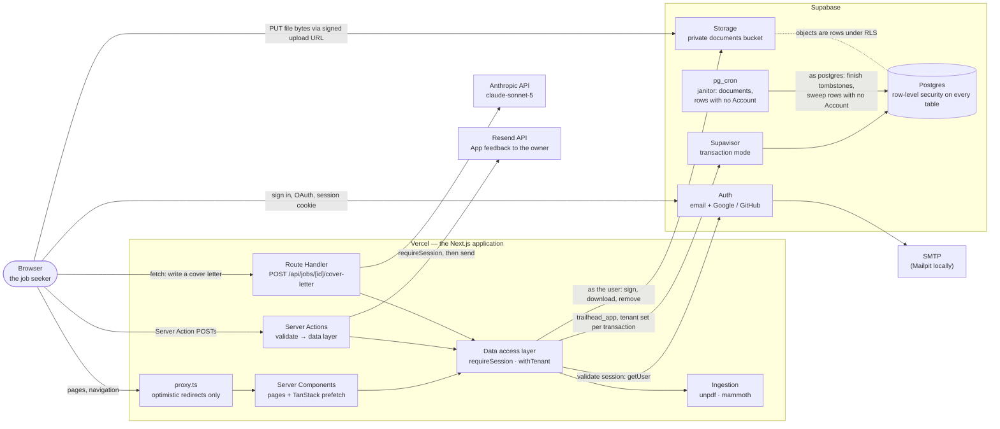
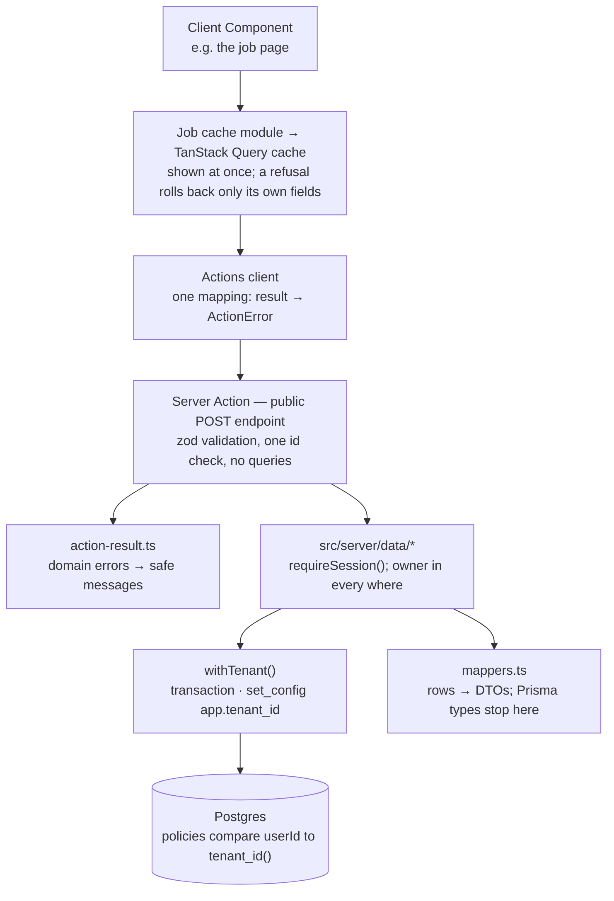
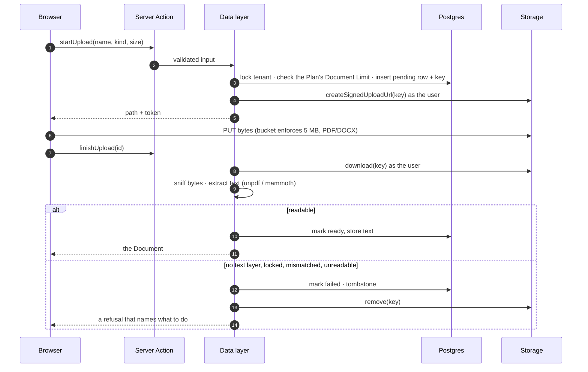
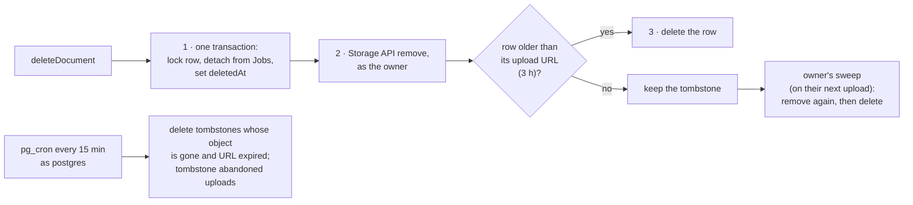
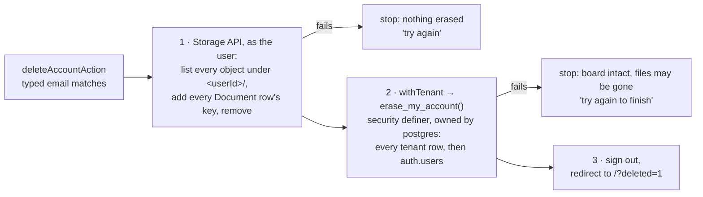
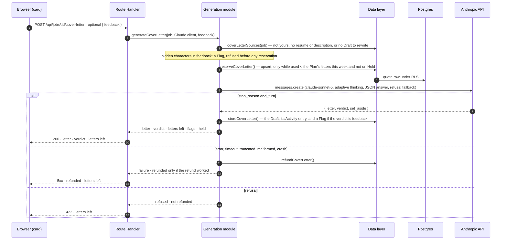
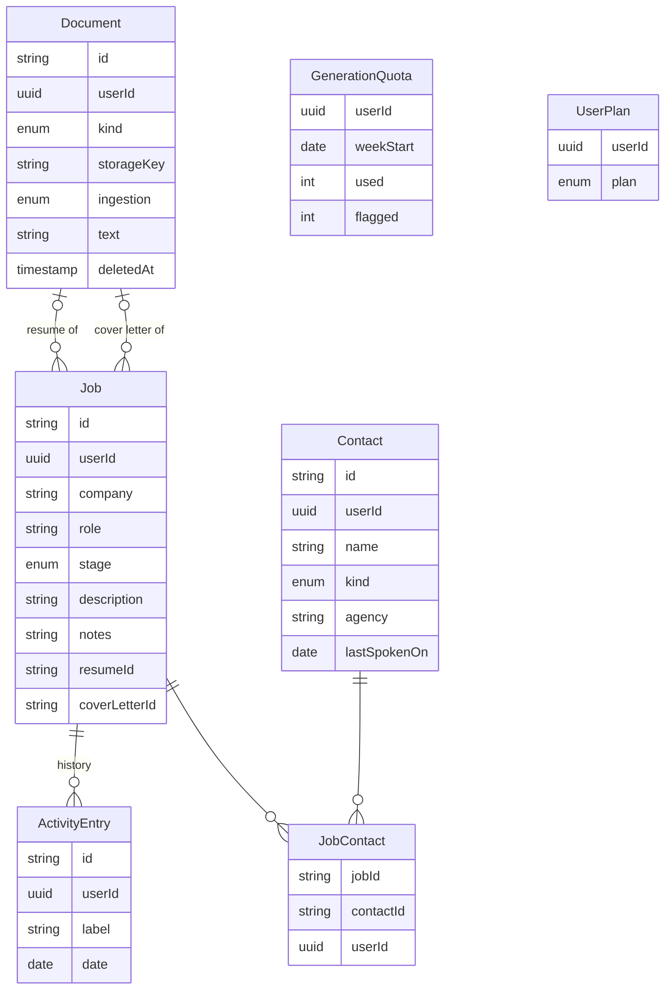

# Architecture

Trailhead is one Next.js application deployed to Vercel, backed by one Supabase project (Postgres,
Auth, Storage), with a single outbound AI call to the Anthropic API and one outbound mail call to
Resend, which carries App feedback to the owner. There is no queue, no worker, and no second
service: generation, document ingestion, and that mail run in-request, and `pg_cron` runs a
janitor with two jobs.

The terms below are the glossary's (`CONTEXT.md`): a **Job**, a **Contact**, a **Document**, a
**Tenant**.

## The system

Two things never pass through the application: **file bytes on the way in** (the browser uploads
straight to Storage through a short-lived signed URL, because a request body through Vercel is capped
below the 5 MB this app accepts) and **any credential that bypasses row-level security** (there is no
`service_role` key anywhere; the app role is `NOBYPASSRLS`).

## A request, layer by layer

Every read and write follows the same path, and each layer has one job. The boundaries are enforced
by `tests/server/boundaries.test.ts`, not just described.

- **Authentication** is checked in three places, and only the last two count: `proxy.ts` redirects on
  the session cookie's say-so (fast, not authorization); pages call `requirePageSession()`; every
  data function calls `requireSession()`, which verifies the access token's signature against Auth's
  signing keys (`getClaims()`; no round trip per request with an asymmetric key).
- **Tenancy is enforced by Postgres.** `withTenant(userId, fn)` opens a transaction whose first
  statement sets `app.tenant_id` transaction-locally; forced RLS policies on every table compare each
  row's `userId` to it, and a query outside a tenant transaction sees nothing. Write checks also
  refuse references to another tenant's rows (a Job's resume, a Contact link).
- **Nothing internal reaches a browser.** Actions and the Route Handler translate typed domain errors
  (`NotFoundError`, `RuleError`, and `AccountDeletionError`, whose message depends on the step that
  failed) into written messages; everything else is logged as one JSON line
  (operation, tenant, error name and message) and the user gets a generic failure.

## Uploading a document

The row exists before the object can: nothing lands in the bucket that the database never knew
about.

## Deleting a document, and the sweep

Storage rows are never deleted with SQL. A tombstone is kept until the signed upload URL minted for
its row has expired, because that URL can put a file back even after the Document is deleted. Objects
are removed only through the Storage API, as their owner — so `pg_cron` finishes rows but cannot
remove files, and a user who never returns can leave a file behind (`docs/deferred.md`).

The janitor's second job, `sweep_accountless()`, runs hourly on a schedule of its own. It deletes
rows in every tenant table whose `userId` has no `auth.users` row: what a second tab writes with an
access token that outlived its Account (below). A row last written within two hours — longer than
an access token lives — is left for a later run, and a Document row is kept while its object still
exists, since that row is the only record of a file no one can now remove.

## Deleting an Account

Account deletion (`CONTEXT.md`) ends the Account and erases its Tenant at once, from the Delete
account section of `/account`. No transaction spans Storage and Postgres, so the order is the design
(ADR-0004, `src/server/data/account.ts`):

- **The function takes no argument.** It erases the tenant in scope — the same transaction-local
  setting every policy trusts — and raises outside `withTenant()`. It is the one thing `trailhead_app`
  can call that reaches `auth.users`; Auth's identities and sessions cascade from it.
- **A retry finishes.** Removing a missing object is a no-op, and the function returns 0 for an
  Account already gone.
- **A token outlives its Account.** `getClaims()` verifies an access token without asking Auth, so
  another tab can write rows until the token expires. The janitor sweeps those rows (above). A file
  uploaded after deletion through a still-valid signed upload URL cannot be removed by anyone
  (`docs/deferred.md`).
- **Logged once per outcome** as operation `account.delete` with the tenant id and, on failure, the
  step — never the email.

## Writing a cover letter

It is a Route Handler, not a Server Action, because Next runs a page's Server Actions one at a time:
a 10–25 second generation as an action would hold every other edit on the page behind it. What is
stored: the quota counter, the Job's Draft (ADR-0002) with its Activity entry, and this week's Flags.
Feedback is never stored. The order — sources, the hidden-character check, reservation, call, store,
refund — and whether a refund really happened belong to the generation module
(`src/server/generation/generate-cover-letter.ts`); the Route Handler checks the session, the id,
and the body, makes one call, and maps the outcome to a status.

A **Flag** is a write whose Feedback the writer reported as directions to it rather than changes to
the letter; the verdict rides on the same call as the letter, so detection never costs a second
model call. Two Flags in a quota week place a **Hold** on letters until Monday; it is derived from
the week's row, never stored, and lifted early only by the migrator (`docs/provisioning.md`).

## The data model

Every table carries its own `userId`, so every policy tests a column rather than reaching through a
parent. Users themselves live in Supabase's `auth` schema, which Prisma does not model.

`UserPlan` is the one table the application role can read but not write (ADR-0001): a Tenant's
Plan decides its Limits — Documents held, cover letters per week — and is set by
`npm run db:plan`, as the migrator. No row means the free Plan. The numbers each Plan allows are
code, in `src/lib/plans.ts`, and the two sites that enforce them read the Plan inside the same
transaction as the count it guards.

## Where the decisions are

- `CONTEXT.md` — the glossary.
- `.scratch/trailhead-build/issues/` — each ticket, with a record of what was built and why. Later
  efforts sit beside it, one directory each: `trailhead-performance`, `trailhead-architecture`,
  `trailhead-board-dnd`, `trailhead-account`.
- `docs/provisioning.md` — the hosted setup, the two database roles, and what was verified on the
  local stack.
- `docs/supersedes.md` and `docs/deferred.md` — what this replaced, and what it deliberately left out.
