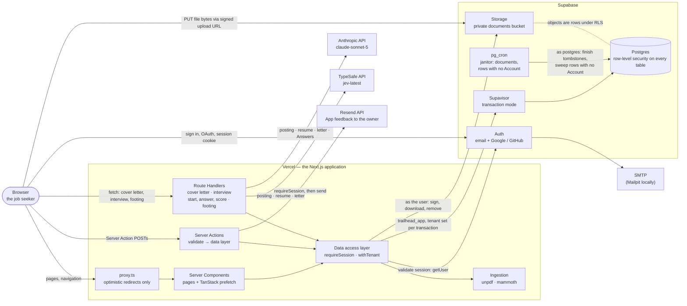
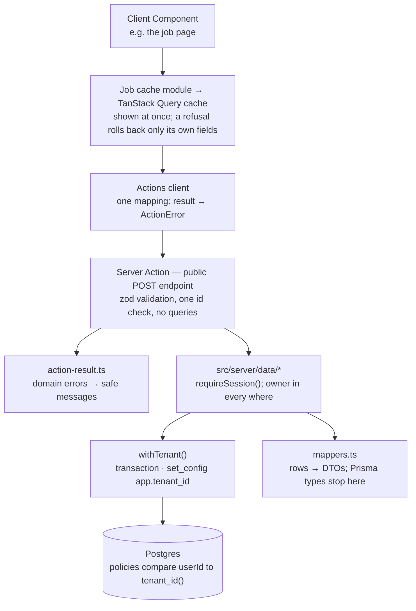
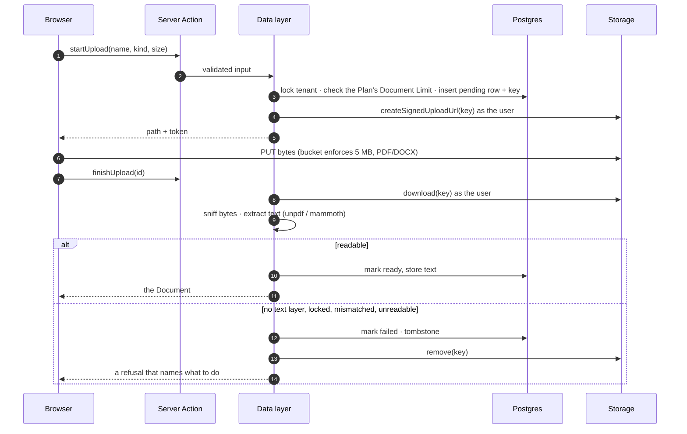
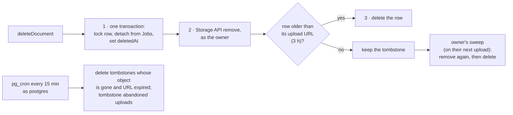
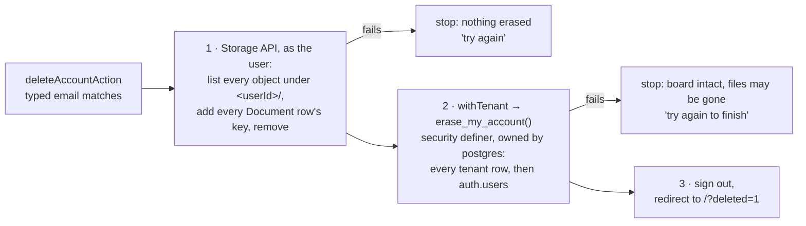
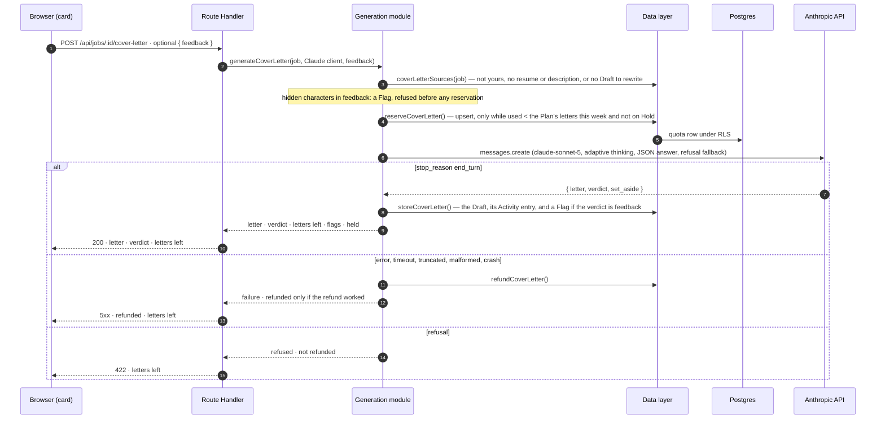
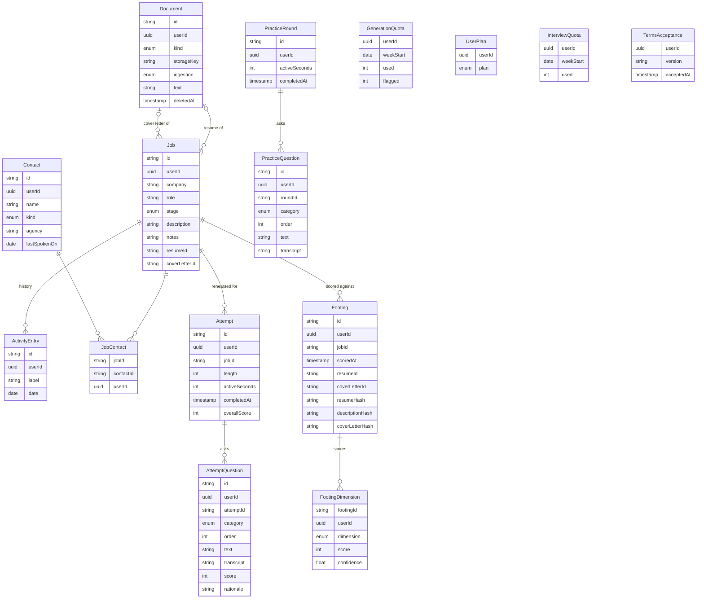

# Architecture

Trailhead is one Next.js application deployed to Vercel, backed by one Supabase project (Postgres,
Auth, Storage), with outbound AI calls to **two providers** and one outbound mail call to Resend,
which carries App feedback to the owner. There is no queue, no worker, and no second service:
generation, interviews, footings, document ingestion, and that mail run in-request, and `pg_cron`
runs a janitor with two jobs.

Which text goes where matters more than which company, so it is stated here rather than implied:

| Provider | Call | What is sent |
| --- | --- | --- |
| **Anthropic** (`claude-sonnet-5`) | Write a cover letter | The Job's description, the resume Document's extracted text, and — on a Rewrite — the previous Draft and the Tenant's Feedback |
| **Anthropic** | Prepare an Attempt's questions | The Job's company, role and description, the resume Document's text, and the questions earlier Attempts asked |
| **Anthropic** | Score an Attempt | The same context, plus every question and the Answer's transcribed words |
| **TypeSafe** (`jev-latest`) | Score a Footing | The Job's company, role and description, the resume Document's text, and the attached cover-letter Document's text |

Neither provider ever receives a **file**: both read text only, so what leaves is the text extracted
at upload and the uploaded object stays in the private bucket. Neither receives an email address, a
name, a Contact, or a Job's private notes. `/privacy` is the user-facing version of this table, and
the two must not disagree.

The terms below are the glossary's (`CONTEXT.md`): a **Job**, a **Contact**, a **Document**, a
**Tenant**.

## The system



Two things never pass through the application: **file bytes on the way in** (the browser uploads
straight to Storage through a short-lived signed URL, because a request body through Vercel is capped
below the 5 MB this app accepts) and **any credential that bypasses row-level security** (there is no
`service_role` key anywhere; the app role is `NOBYPASSRLS`).

## A request, layer by layer

Every read and write follows the same path, and each layer has one job. The boundaries are enforced
by `tests/server/boundaries.test.ts`, not just described.



- **Authentication** is checked in three places, and only the last two count: `proxy.ts` redirects on
  the session cookie's say-so (fast, not authorization); pages call `requirePageSession()`; every
  data function calls `requireSession()`, which verifies the access token's signature against Auth's
  signing keys (`getClaims()`; no round trip per request with an asymmetric key).
- **Tenancy is enforced by Postgres.** `withTenant(userId, fn)` opens a transaction whose first
  statement sets `app.tenant_id` transaction-locally; forced RLS policies on every table compare each
  row's `userId` to it, and a query outside a tenant transaction sees nothing. Write checks also
  refuse references to another tenant's rows (a Job's resume, a Contact link).
- **Nothing internal reaches a browser.** Actions and the Route Handlers translate typed domain errors
  (`NotFoundError`, `RuleError`, and `AccountDeletionError`, whose message depends on the step that
  failed) into written messages; everything else is logged as one JSON line
  (operation, tenant, error name and message) and the user gets a generic failure.

## Uploading a document



The row exists before the object can: nothing lands in the bucket that the database never knew
about.

## Deleting a document, and the sweep



Storage rows are never deleted with SQL. A tombstone is kept until the signed upload URL minted for
its row has expired, because that URL can put a file back even after the Document is deleted. Objects
are removed only through the Storage API, as their owner — so `pg_cron` finishes rows but cannot
remove files, and a user who never returns can leave a file behind (`docs/deferred.md`).

The janitor's second job, `sweep_accountless()`, runs hourly on a schedule of its own. It deletes
rows in every tenant table whose `userId` has no `auth.users` row: what a second tab writes with an
access token that outlived its Account (below). A row last written within two hours — longer than
an access token lives — is left for a later run, and a Document row is kept while its object still
exists, since that row is the only record of a file no one can now remove.

## Deleting an Account

Account deletion (`CONTEXT.md`) ends the Account and erases its Tenant at once, from the Delete
account section of `/account`. No transaction spans Storage and Postgres, so the order is the design
(ADR-0004, `src/server/data/account.ts`):



- **The function takes no argument.** It erases the tenant in scope — the same transaction-local
  setting every policy trusts — and raises outside `withTenant()`. It is the one thing `trailhead_app`
  can call that reaches `auth.users`; Auth's identities and sessions cascade from it.
- **A retry finishes.** Removing a missing object is a no-op, and the function returns 0 for an
  Account already gone.
- **A token outlives its Account.** `getClaims()` verifies an access token without asking Auth, so
  another tab can write rows until the token expires. The janitor sweeps those rows (above). A file
  uploaded after deletion through a still-valid signed upload URL cannot be removed by anyone
  (`docs/deferred.md`).
- **Logged once per outcome** as operation `account.delete` with the tenant id and, on failure, the
  step — never the email.

## Writing a cover letter



It is a Route Handler, not a Server Action, because Next runs a page's Server Actions one at a time:
a 10–25 second generation as an action would hold every other edit on the page behind it. What is
stored: the quota counter, the Job's Draft (ADR-0002) with its Activity entry, and this week's Flags.
Feedback is never stored. The order — sources, the hidden-character check, reservation, call, store,
refund — and whether a refund really happened belong to the generation module
(`src/server/generation/generate-cover-letter.ts`); the Route Handler checks the session, the id,
and the body, makes one call, and maps the outcome to a status.

A **Flag** is a write whose Feedback the writer reported as directions to it rather than changes to
the letter; the verdict rides on the same call as the letter, so detection never costs a second
model call. Two Flags in a quota week place a **Hold** on letters until Monday; it is derived from
the week's row, never stored, and lifted early only by the migrator (`docs/provisioning.md`).

## The Interview Simulator

Rehearsing for one Job (`CONTEXT.md`: an **Attempt**, its **Categories**, its **Answers**, its
**Scorecard**) reuses the cover letter's shape rather than inventing a second one — a server-only
Anthropic module, an orchestration layer that owns the quota, Route Handlers that only map an outcome
to a status, and the same four test seams. What differs is worth saying:

- **Two calls, not one.** Starting an Attempt generates its question set from the Job's description
  and the Tenant's resume; scoring sends those questions and their Answers back for a mark and a
  rationale each. Both are non-streaming and JSON-schema-constrained, and an answer that does not fit
  the schema — a score off the scale, a Category mix short of one dimension — is malformed rather than
  a result. That is what stops an Answer from talking the scorer into a Scorecard it may not give.
- **A quota of its own.** `InterviewQuota` is a separate table from `GenerationQuota`, not a column on
  it: that one's Flag and Hold semantics are specific to cover-letter Feedback abuse and mean nothing
  here. An Attempt is reserved before generation and given back only if generation fails — abandoning
  a delivered question set never refunds. Scoring spends nothing: the Attempt was counted when it
  started, so a scoring failure is always safe to retry.
- **The clock is active-time accounted, not a deadline.** An Attempt stores the seconds it has
  actually been answered for, and each Answer's request carries what that question cost — including
  any submissions of it that failed, so a retry can't hand time back. There is no pause between
  questions: Go puts the first up with its clock running, and each submission puts the next one up
  the same way; the clock stands still only while an Answer is on its way to the server, or while the
  microphone has failed and the Tenant is fixing it. Closing the
  tab drains nothing, and returning resumes on the question that was reached — never inside the one
  abandoned mid-way, because an Answer is only ever recorded whole.
- **No audio anywhere.** A spoken Answer is transcribed by the browser's own speech recognition;
  only the text is sent. There is no recorder in the client and no audio column in the schema. The
  soundwave follows the recogniser's own `speechstart`/`speechend` events rather than a level meter,
  which would have meant opening a second microphone stream.
- **Gated on the Plan this phase, not a Limit** (ADR-0005): free and basic see the real start screen
  locked, and their recorded Limits are not yet enforced.
- **Spoken answers only.** There is no typing an Answer; a browser that cannot transcribe cannot
  start or resume a run.
- **Questions asked aloud.** The browser's own speech synthesis reads each question first; its clock
  and the microphone start once the voice is done, skipped, hasn't begun within 1.5 s, or overruns a
  guard, so a silent or stuck voice can never freeze a run. Every tap that leads to a question being
  read primes the voice first, because iPhone Safari only speaks once speech has begun inside a tap.
- **The Tutorial is kept nowhere.** One guided question on the same run screen, run entirely in the
  page. Whether to offer it is read from the data — no finished Practice round or Attempt — and from
  a flag in the browser's localStorage once finished or skipped; nothing about it is stored on the
  server.
- **Practice rounds beside it, not inside it** (ADR-0006). Free and basic can take a Practice round —
  four questions from a fixed set, unscored, no model call, no quota — stored in `PracticeRound` and
  `PracticeQuestion` rather than as an Attempt without a Job. The two share the run screen and the
  timing rules over `TimedRun`, and nothing else.

## Scoring a Footing

A **Footing** (`CONTEXT.md`; **ADR-0007**) is the kept result of scoring one Job's posting against its
Application kit. It reuses the same shape as the other two model calls — a server-only provider module
that reads the key and nowhere else does, an orchestration layer that owns the order things happen in,
and a Route Handler that only maps an outcome to a status — against a different provider.

```mermaid
sequenceDiagram
  autonumber
  participant B as Browser (job page)
  participant R as Route Handler
  participant S as Footing module
  participant D as Data layer
  participant PG as Postgres
  participant T as TypeSafe API

  B->>R: POST /api/jobs/:id/footing · no body
  R->>S: footingScore(job, TypeSafe client)
  S->>D: footingSources(job) — not yours, no resume, or no description: refused before anything is spent
  S->>D: footingsToday() — the per-Tenant daily ceiling, a circuit breaker rather than a Limit
  D->>PG: count of today's Footings under RLS
  S->>T: systemOne — one state, one score question per dimension, evaluated in parallel
  alt every dimension answered within its rubric
    T-->>S: a position and a confidence per dimension
    S->>D: footingHistory(job) — what this one is replacing, for the comparison sentence
    S->>D: storeFooting() — one Footing row and one row per dimension, in one transaction
    S-->>R: the Footing · the one before it
    R-->>B: 200 · bands only; the 0–100 is computed, banded, and never rendered
  else no key, not ready, ceiling, timeout, provider error, or a score outside the rubric
    S-->>R: the reason · nothing stored
    R-->>B: 4xx/5xx · the reason, in the words the page shows
  end
```

What is different from the other two, and why:

- **No Limit, and no Plan check.** A Footing costs about $0.0002, so it is on every Plan with nothing
  in `PLAN_LIMITS` about it (**ADR-0007**). The daily ceiling in `src/server/data/footing.ts` is a
  circuit breaker so a re-score loop from a bug costs cents and stops — never shown, never in the Plan
  comparison, never an upsell. It lives server-side precisely so no component can import it.
- **Nothing is reserved, so nothing is refunded.** A failure stores nothing and costs nothing, which
  is why there is no counterpart to the quota dance the letter and the Attempt both do.
- **Append-only.** Scoring inserts; nothing updates or deletes a Footing. The newest row for a Job is
  "the Footing" and the rest are its history — the only feedback loop the feature has, since it is what
  makes "did the rewritten resume actually score better" answerable.
- **The overall band is derived, never stored.** Only each dimension's own 0–100 is, so tuning the
  weights in `src/lib/footing.ts` re-reads history correctly instead of leaving a number no formula
  explains.
- **Staleness is stamped, not recomputed.** Each Footing keeps SHA-256 hashes of the description, the
  resume text and the letter text, plus the Document ids. Reading a Job compares them; a stale Footing
  is shown with a line saying what moved, and running it again is the Tenant's act. The hashes outlive
  the Documents, so a Footing whose resume was deleted is kept and reads permanently stale — which is
  why `resumeId` and `coverLetterId` carry no foreign key.
- **A smaller injection surface.** The rubrics are fixed by us, the state is pure data, nothing is
  generated and there are no tools, so the worst a hostile posting can do is nudge a level. It still
  gets `stripInvisible` on the way in, for consistency rather than necessity.

## The data model



`Footing.resumeId` and `Footing.coverLetterId` are plain columns, not foreign keys: a Footing whose
Document was later deleted is kept and reads permanently stale, so the stamp has to outlive the
Document rather than cascade away with it. `TermsAcceptance` records which version of the terms an
Account agreed to and when (**ADR-0008**); it is append-only, and it is a table rather than Supabase
`user_metadata` because the subject can write their own metadata and so it cannot hold a record about
that subject.

Every table carries its own `userId`, so every policy tests a column rather than reaching through a
parent. Users themselves live in Supabase's `auth` schema, which Prisma does not model.

`UserPlan` is the one table the application role can read but not write (ADR-0001): a Tenant's
Plan decides its Limits — Documents held, cover letters per week, Interview Simulator Attempts per
week — and is set by
`npm run db:plan`, as the migrator. No row means the free Plan. The numbers each Plan allows are
code, in `src/lib/plans.ts`, and the two sites that enforce them read the Plan inside the same
transaction as the count it guards.

## Where the decisions are

- `CONTEXT.md` — the glossary.
- `.scratch/trailhead-build/issues/` — each ticket, with a record of what was built and why. Later
  efforts sit beside it, one directory each: `trailhead-performance`, `trailhead-architecture`,
  `trailhead-board-dnd`, `trailhead-account`.
- `docs/provisioning.md` — the hosted setup, the two database roles, and what was verified on the
  local stack.
- `docs/supersedes.md` and `docs/deferred.md` — what this replaced, and what it deliberately left out.
